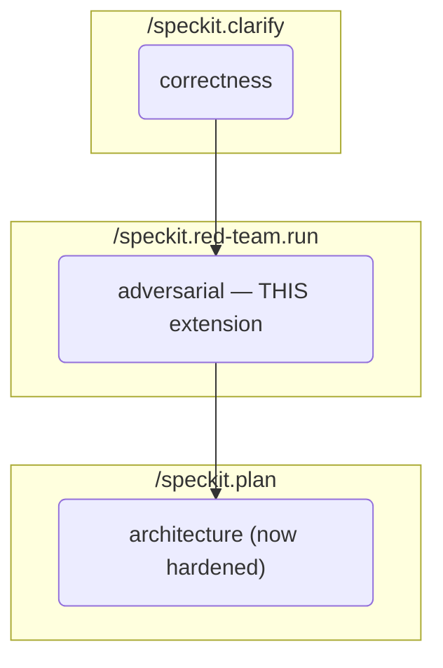

# Red Team — a Spec Kit extension

**Adversarial review of functional specs before `/speckit.plan` locks in architecture.** Complementary to the built-in `/speckit.clarify` (correctness) and `/speckit.analyze` (consistency) commands — this extension adds an adversarial layer that structurally catches issues those tools cannot.

- **Version:** 1.0.2
- **Repository:** https://github.com/ashbrener/spec-kit-red-team
- **License:** MIT
- **Requires:** Spec Kit ≥ 0.1.0
- **Commands:** `/speckit.red-team.run`, `/speckit.red-team.gate` (auto-invoked as a `before_plan` hook)

## Why adversarial review

Clarify and analyze are structurally incapable of surfacing certain classes of issue. Examples:

| Issue class | Clarify? | Analyze? | Red team? |
|---|---|---|---|
| Prompt injection via untrusted LLM inputs | ❌ | ❌ | ✅ |
| Self-approval segregation-of-duties gaps in workflows that are internally consistent | ❌ | ❌ | ✅ |
| Race conditions at configuration-change boundaries | ❌ | ❌ | ✅ |
| Cross-spec drift between cooperating halves of an interface contract | ❌ | partial | ✅ |
| "Immutable" records with no storage-layer integrity enforcement | ❌ | ❌ | ✅ |
| Silent failures that satisfy the schema but violate intent | ❌ | ❌ | ✅ |

Without a red team step, these defects tend to land as production incidents instead of spec-phase fixes. This extension runs 3–5 lens-specific adversary agents in parallel against a spec, aggregates their findings into a structured report, and walks the maintainer through per-finding resolution.

## How it works



1. You invoke `/speckit.red-team.run <target-spec-path>` after `/speckit.clarify` completes.
2. The command reads your project's **lens catalog** at `.specify/extensions/red-team/red-team-lenses.yml` (scaffolded by `specify extension add red-team` from the shipped `config-template.yml`).
3. It scans the target spec for six **trigger categories** (money-path, regulatory-path, AI/LLM correctness, immutability/audit, multi-party, contracts). A spec matching ≥1 category qualifies.
4. Lenses whose `trigger_match` overlaps the spec's triggers are selected. When >5 match, a propose-and-confirm UX ranks by trigger-match strength + severity weight; `--yes` auto-accepts.
5. 3–5 adversary agents dispatch **in parallel** via the host AI agent's sub-agent primitive (e.g., Claude Code's Agent tool). Each agent attacks with the lens's core questions and returns top-N findings ranked by severity.
6. Findings aggregate into a structured markdown report at `specs/<feature-id>/red-team-findings-<YYYY-MM-DD>[-NN].md`.
7. For each finding, you categorise into one of four **resolution categories**: `spec-fix` / `new-OQ` / `accepted-risk` / `out-of-scope`. The extension never auto-applies spec changes — every resolution is maintainer-authorised.

## Install

```bash
specify extension add red-team
```

This pulls the extension from the community catalog, drops the command into your AI agent's registered commands, and scaffolds `.specify/extensions/red-team/red-team-lenses.yml` from the shipped template.

Alternatively, install from this repo directly:

```bash
specify extension add --from https://github.com/ashbrener/spec-kit-red-team
```

## Adopt — the 3 steps every project takes

1. **Customise the lens catalog.** Edit `.specify/extensions/red-team/red-team-lenses.yml` to declare the adversarial lenses calibrated for your project's domain. The shipped template has two examples (Regulatory Adversary, Trust-Boundary Adversary) with inline schema documentation — delete, edit, or extend as needed.

2. **Declare trigger criteria in your constitution (optional but recommended).** Add a `## Red Team Trigger Criteria` section to `.specify/memory/constitution.md` listing which trigger categories your project cares about. Without this section the command falls back to the six default categories with a warning — fine for bootstrapping, but your constitution is where this belongs long-term.

3. **Invoke it where it fits your workflow.** Typical flow: `/speckit.specify` → `/speckit.clarify` → **`/speckit.red-team.run`** → `/speckit.plan` → `/speckit.tasks` → `/speckit.analyze` → `/speckit.implement`. The red team runs once the spec is clarified but before architecture gets locked in.

   From v1.0.2 the extension also ships a **mandatory `before_plan` gate** (`/speckit.red-team.gate`). Once installed, `/speckit.plan` auto-invokes the gate on every run:
   - **Non-qualifying spec** (no trigger categories matched) → gate returns `PROCEED` silently; no user-visible change.
   - **Qualifying spec with findings on record** → gate returns `SATISFIED`, prints the findings path, proceeds.
   - **Qualifying spec with no findings** → gate returns `HALT`. `/speckit.plan` stops and offers two explicit options: run `/speckit.red-team.run` now, or opt out with `--skip-red-team-gate: <reason>` which the plan records as an Accepted Risk tagged `[red-team-skipped]`.

   The gate is a keyword-based scan (deliberately over-broad — it errs on the side of offering a red team you may not need, never skipping one you do). A project that does not want the gate simply does not install this extension.

## Usage

```
/speckit.red-team.run <target-spec-path> [--yes] [--lenses name1,name2,...] [--dry-run] [--session-suffix NN]
```

| Argument | Required | Description |
|---|---|---|
| `<target-spec-path>` | Yes | Path (relative to repo root) of the functional spec to attack. E.g. `specs/001-my-feature/spec.md`. |
| `--yes` | No | Auto-confirm the proposed lens selection when >5 lenses match. Required for CI / batch invocations. |
| `--lenses <names>` | No | Explicit override of lens selection. Skips trigger-matching; runs exactly the listed lenses. |
| `--dry-run` | No | Print which lenses would run + the matched triggers, but don't dispatch agents. |
| `--session-suffix <NN>` | No | Override the trailing ordinal in the session ID (for multiple sessions on the same day). |

### Examples

**Interactive run on a qualifying spec:**

```
/speckit.red-team.run specs/001-my-feature/spec.md
```

**CI / batch run — accept proposed default lens set:**

```
/speckit.red-team.run specs/001-my-feature/spec.md --yes
```

**Explicit lens selection — useful for re-running a single failed lens:**

```
/speckit.red-team.run specs/001-my-feature/spec.md --lenses "Regulatory Adversary"
```

**Preview without dispatching agents:**

```
/speckit.red-team.run specs/001-my-feature/spec.md --dry-run
```

## Findings report shape

The command writes a markdown report with five sections:

1. **Session Summary** — maintainer-authored post-review prose (1–3 sentences).
2. **Findings** — table of all findings: `ID | Lens | Severity | Location | Finding | Suggested Resolution | Status`.
3. **Resolutions Log** — per-finding resolution block recording category (spec-fix / new-OQ / accepted-risk / out-of-scope), applied-at date, maintainer, downstream reference.
4. **Validation Decision** *(only for designated dogfood sessions)* — outcome (`proceed-to-codification` / `refine-and-retry` / `abandon`), meaningful-findings summary.
5. **Session Metadata** — machine-readable YAML block for audits, dashboards, and tooling.

## The hard-and-fast rule: no rewriting historical records

**Resolution edits MUST land in forward-facing canonical locations only:**

✅ **Editable**: `04_Functional_Specs/` (or project-equivalent graduated docs tree), `03_Product_Requirements/`, `02_System_Architecture/`, `01_Business_Overview/`, `.specify/memory/constitution.md`, `.specify/templates/`.

❌ **Never edit**: `specs/<feature-id>/spec.md`, `plan.md`, `tasks.md`, `research.md`, `data-model.md`, `contracts/`, `quickstart.md`, `checklists/`. These are SpecKit working records — immutable point-in-time audit trails. The findings report file (`specs/<feature-id>/red-team-findings-*.md`) is the exception: it's created and owned by this extension.

If a finding's natural fix would require editing a historical record, route it to (a) the forward-facing canonical equivalent, (b) an Accepted Risk on a forward-facing spec, or (c) an out-of-scope cross-reference to a future feature spec.

## Configuration

See `config-template.yml` for the full lens catalog schema. Key fields per lens:

| Field | Required | Description |
|---|---|---|
| `name` | Yes | Unique within the catalog |
| `description` | Yes | 1-2 sentence summary of the adversarial angle |
| `core_questions` | Yes | The attack brief — ≥1 entry, 3+ recommended |
| `trigger_match` | Yes | ≥1 of: `money_path`, `regulatory_path`, `ai_llm`, `immutability_audit`, `multi_party`, `contracts` |
| `severity_weight` | No | Default 5; tie-breaker in lens ranking when >5 match |
| `finding_bound` | No | Default 5; top-N findings emitted per lens |

## Troubleshooting

### `ERROR: no lens catalog at .specify/extensions/red-team/red-team-lenses.yml`

The extension config wasn't scaffolded. Run `specify extension add red-team` to install (which scaffolds the catalog from the template), or manually copy `config-template.yml` from this repo to the expected path.

### `ERROR: lens catalog has no lenses defined`

Your catalog's top-level `lenses:` list is empty. Add at least one lens — see `config-template.yml` for examples.

### `INFO: target spec matches no trigger categories — no red team required`

The target spec doesn't match any of the six default trigger categories (money-path, regulatory-path, ai-llm, immutability-audit, multi-party, contracts). This is **not** an error — it means red team isn't warranted. To run anyway (voluntarily), pass `--lenses` with an explicit lens list.

### `WARNING: constitution does not yet declare red team trigger criteria`

Your `.specify/memory/constitution.md` doesn't contain a `## Red Team Trigger Criteria` section. The command proceeds in "bootstrap mode" using the six default categories. Add the section to your constitution once your project has settled on which categories apply.

### An adversary agent returned no findings / errored out

Recorded in session metadata with the lens name and failure reason. Other lenses proceed. Re-run the failed lens via `--lenses <lens-name>` after refining its `core_questions`.

### Overwhelming findings (≥25 HIGH+CRITICAL combined)

The command warns and offers an abort path. This is a signal that the spec isn't ready for red team — reshape or break into smaller scope first. Abort records session state so you can resume after.

## Related work

- **Spec Kit core** — https://github.com/github/spec-kit
- **Extension Development Guide** — https://github.com/github/spec-kit/blob/main/extensions/EXTENSION-DEVELOPMENT-GUIDE.md
- **Community extension catalog** — https://github.com/github/spec-kit/blob/main/extensions/catalog.community.json

## Acknowledgements

Originally proposed as a core command (github/spec-kit#2303); converted to an extension per maintainer guidance and refined with Copilot review feedback.

## License

MIT — see [LICENSE](LICENSE).
