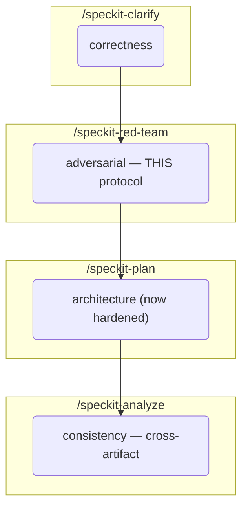
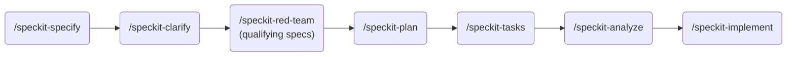
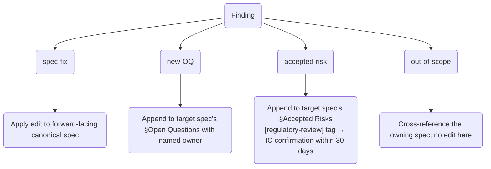
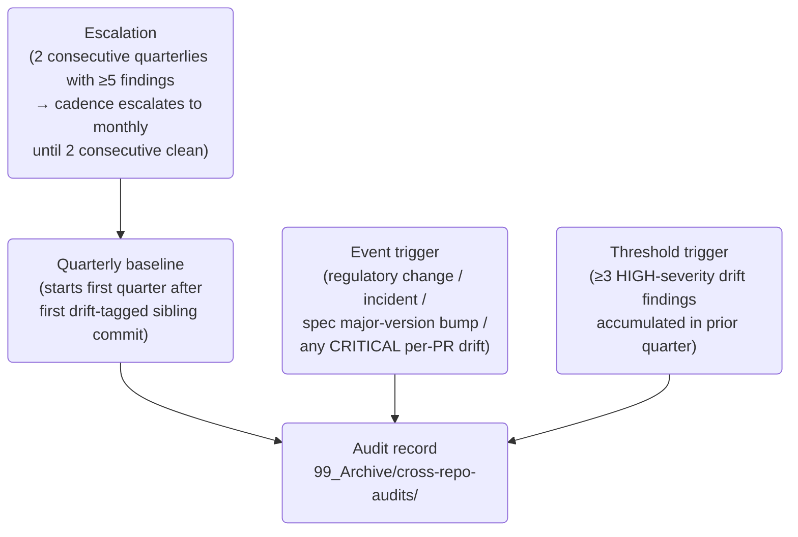

# Red Team Protocol — Architecture

## Purpose

Canonical cross-repo reference for the Red Team Protocol. The protocol runs adversarial lens reviews against functional specs before `/speckit-plan` locks in architecture, and enforces implementation-drift review at sibling-repo PR time. This document is the single point of truth every consumer (`pp-docs` constitution Principle VIII, `pp-backend` constitutional amendment, `pp-frontend` constitutional amendment, community-published extension) cites.

## Contents

1. [Overview](#1-overview)
2. [Pipeline Position](#2-pipeline-position)
3. [Trigger Criteria](#3-trigger-criteria)
4. [Lens Catalog](#4-lens-catalog)
5. [Resolution Categories](#5-resolution-categories)
6. [Hard-and-Fast Rule: No Rewriting Historical Records](#6-hard-and-fast-rule-no-rewriting-historical-records)
7. [Sibling-Repo Drift Obligation](#7-sibling-repo-drift-obligation)
8. [Cross-Repo Audit Cadence](#8-cross-repo-audit-cadence)
9. [Distribution & Adoption](#9-distribution--adoption)
10. [Provenance](#10-provenance)

## 1. Overview

Correctness (`/speckit-clarify`) and consistency (`/speckit-analyze`) are structurally incapable of surfacing certain classes of issue — prompt injection in untrusted LLM inputs, self-approval segregation-of-duties gaps in workflows that are internally consistent, race conditions at configuration-change boundaries, cross-spec drift between cooperating halves of an interface contract, missing audit-chain integrity on "immutable" records. The red team adds an adversarial layer.

**Inputs**: a functional spec (either a SpecKit working record `specs/<feature-id>/spec.md` or a graduated canonical `04_Functional_Specs/<Component>_Functional_Spec_v*.md`) + a project-specific lens catalog (`.specify/red-team-lenses.yml` when vendored, `.specify/extensions/red-team/red-team-lenses.yml` when installed as community extension).

**Output**: a structured findings report at `specs/<feature-id>/red-team-findings-<YYYY-MM-DD>[-NN].md` with a per-finding resolution log. Findings report is immutable after session close; moved to `99_Archive/red-team/<feature-id>/` when the spec graduates from v0.x DRAFT to v1.0 (per Clarifications Q3, feature 006).

## 2. Pipeline Position

The protocol runs AFTER `/speckit-clarify` and BEFORE `/speckit-plan` — the spec is clarified internally, then attacked adversarially, then architecture is locked in against the hardened spec.

Qualifying specs (those matching one or more Trigger Criteria in §3) MUST pass through red team before `/speckit-plan` per **pp-docs constitution Principle VIII** (v1.2.0). Non-qualifying specs MAY invoke the protocol voluntarily.

## 3. Trigger Criteria

A spec qualifies for red team if it touches ANY of the following six categories (OR-combined):

| # | Category | Trigger condition |
|---|---|---|
| 1 | `money_path` | Computes, transfers, or represents monetary values (fees, amounts, rates, allocations). |
| 2 | `regulatory_path` | Process is subject to regulatory requirements (KYC/AML, fund compliance, advisor rules, audit reporting). |
| 3 | `ai_llm` | Relies on LLM inference for a correctness-sensitive output (classification, summarisation, scoring, extraction). |
| 4 | `immutability_audit` | Declares immutability or audit-trail guarantees. |
| 5 | `multi_party` | Coordinates ≥2 human roles with different authority levels (approval gates, IC roles, partner decisions). |
| 6 | `contracts` | Defines an upstream/downstream interface contract (API boundary, document handoff, data format). |

Match is ANY, not ALL. Authoritative source: pp-docs constitution §Red Team Trigger Criteria (v1.2.0+).

## 4. Lens Catalog

Each lens is a named adversarial perspective with its own attack brief (`core_questions`), a subset of triggers it applies to (`trigger_match`), and per-lens severity + finding bound weights.

PP v1.0 lens set (9 lenses, defined in `pp-docs/.specify/red-team-lenses.yml`):

| Lens | Adversarial angle | Triggers |
|---|---|---|
| Regulatory Adversary | Examiner's perspective — what gets flagged in enforcement? | `regulatory_path`, `money_path` |
| AI/LLM Adversary | Hallucination, prompt injection, silent failure, stochasticity | `ai_llm` |
| Immutability Adversary | Mutation paths, retroactive edits, silent overwrites | `immutability_audit` |
| Money-Math Adversary | Precision, rounding, currency, negative-number edge cases | `money_path` |
| Race/Concurrency Adversary | Race conditions, double-submits, reorderings | `multi_party`, `contracts` |
| Trust-Boundary Adversary | Implicitly-trusted inputs, authorisation gaps, privilege escalation | `multi_party`, `contracts` |
| Configuration-Drift Adversary | Config update mid-processing, stale snapshots, rollforward | `immutability_audit`, `contracts` |
| Human-Error Adversary | UX traps, misclicks, mis-readings, fatigue errors | `multi_party`, `ai_llm` |
| Documentation-Drift Adversary | Cross-spec terminology drift, stale references, unsynchronised versions | `contracts`, `regulatory_path` |

### Lens selection

The protocol selects 3–5 lenses whose `trigger_match` intersects the target spec's matched triggers. When more than 5 match:

- Rank by overlap count (primary) + `severity_weight` (tie-breaker) + alphabetical (final tie-breaker).
- Propose the top-5 as default.
- `--yes` auto-accepts; interactive runs prompt for accept / swap / expand.

Detail: `specs/006-red-team-protocol/contracts/skill-interface.md` §4.

## 5. Resolution Categories

Every finding MUST be categorised into exactly one of:

Authoriser for Accepted Risks: Tech Lead by default. `[regulatory-review]`-tagged ARs require IC retroactive confirmation within 30 days or next IC meeting (whichever sooner) — per Clarifications Q1, feature 006.

## 6. Hard-and-Fast Rule: No Rewriting Historical Records

**Resolution edits MUST land in forward-facing canonical locations only.**

| Path pattern | Category | Editable during resolution? |
|---|---|---|
| `04_Functional_Specs/*` | Forward-facing canonical spec | ✅ Yes |
| `03_Product_Requirements/PRD_*` | Forward-facing canonical spec | ✅ Yes |
| `02_System_Architecture/*` | Forward-facing canonical spec | ✅ Yes |
| `01_Business_Overview/*` | Forward-facing canonical spec | ✅ Yes |
| `.specify/memory/constitution.md` | Forward-facing governance | ✅ Yes |
| `.specify/templates/*` | Forward-facing tooling config | ✅ Yes |
| `specs/<feature-id>/spec.md`, `plan.md`, `tasks.md`, `research.md`, `data-model.md`, `contracts/*`, `quickstart.md`, `checklists/*` | **HISTORICAL SpecKit working record** | ❌ **NO — never edit** |
| `specs/<feature-id>/red-team-findings-*.md` | Session artifact owned by this protocol | ✅ Yes |
| `99_Archive/*` | Archived historical | ❌ NO — never edit |

Rationale: SpecKit working records in `specs/<feature-id>/` capture a point-in-time decision state. They are the audit trail of "what was decided at time T." Rewriting them destroys that audit trail.

Enforcement: **feature 006 FR-013a** + the red team skill's §7 pre-edit check. If a finding's natural fix would require editing a historical record, route to (a) forward-facing canonical equivalent, (b) accepted-risk on a forward-facing spec, or (c) out-of-scope cross-reference to a future feature.

## 7. Sibling-Repo Drift Obligation

When a sibling repo (`pp-backend`, `pp-frontend`) implements a functional spec from `pp-docs`, it inherits a **drift red team** obligation:

- Every PR implementing a functional spec MUST include a "Drift Red Team" section in the PR description. Empty section blocks merge.
- Every commit implementing a functional spec MUST carry a `[drift-red-team: <path>]` tag in its message, pointing at a findings file in the sibling repo.
- Drift findings route through the same four resolution categories as docs-level findings (one funnel, not two).

Implementation: sibling-repo constitution amendments drafted at `specs/006-red-team-protocol/sibling-amendments/` are applied when implementation begins in that repo. Activation is deferred until the sibling repo has its first PR implementing a pp-docs functional spec.

## 8. Cross-Repo Audit Cadence

A periodic audit compares sibling-repo implementation against each functional spec as a safety net on top of the per-PR drift review.

**Hybrid cadence** (per Clarifications Q2, feature 006):

Audit ownership: pp-docs (Tech Lead). Findings route through the standard four resolution categories — one funnel.

## 9. Distribution & Adoption

The protocol is distributed through two parallel surfaces:

### A. PP-internal (this project)

- **Skill**: vendored at `pp-docs/.claude/skills/speckit-red-team/SKILL.md`. Identical logic to the public extension; kept in-repo for dogfood parity and so pp-docs is self-contained.
- **Lens catalog**: `pp-docs/.specify/red-team-lenses.yml` (9 lenses per §4).
- **Invocation**: `/speckit-red-team <target-spec-path>`.

### B. Community (for other SpecKit projects)

- **Extension repo**: [`ashbrener/spec-kit-red-team`](https://github.com/ashbrener/spec-kit-red-team) — public, MIT-licensed, v1.0.0 released.
- **Community catalog PR**: [`github/spec-kit#2306`](https://github.com/github/spec-kit/pull/2306) — pending merge, adds the extension to `extensions/catalog.community.json`.
- **Install** (once catalog PR merges): `specify extension add red-team`
- **Install (direct URL, available today)**: `specify extension add --from https://github.com/ashbrener/spec-kit-red-team`
- **Invocation**: `/speckit.red-team.run <target-spec-path>` (extension command namespace).

Behaviour is identical between the two surfaces; only the invocation name and the lens catalog path differ (see Provenance below for the drift-parity history).

## 10. Provenance

| Version | Date | Author | Changes |
| :------ | :--- | :----- | :------ |
| v0.1 DRAFT | 2026-04-22 | Ash Brener | Initial publication. Consolidates feature 006 (specs/006-red-team-protocol/) into a canonical cross-repo reference. Reflects: constitutional amendment v1.1.1 → v1.2.0 adding Principle VIII + Red Team Trigger Criteria; dogfood Session RT-005-triage-engine-spec-2026-04-21-01 proceed-to-codification outcome (25 findings, 19 meaningful); community extension `ashbrener/spec-kit-red-team` v1.0.0 release and pending catalog PR github/spec-kit#2306. |

### Referenced by

- `pp-docs/.specify/memory/constitution.md` (Principle VIII)
- `pp-docs/specs/006-red-team-protocol/sibling-amendments/pp-backend-constitution-amendment.md`
- `pp-docs/specs/006-red-team-protocol/sibling-amendments/pp-frontend-constitution-amendment.md`
- `pp-docs/specs/006-red-team-protocol/sibling-amendments/pp-backend-pr-template-draft.md`
- `pp-docs/specs/006-red-team-protocol/sibling-amendments/pp-frontend-pr-template-draft.md`
- Community: [spec-kit-red-team/README.md](https://github.com/ashbrener/spec-kit-red-team/blob/main/README.md)
