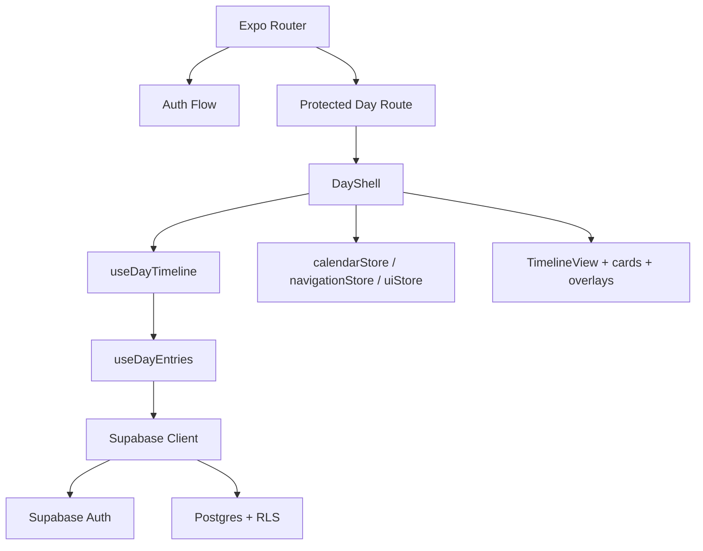

# Architecture

## System Overview

Echotes e um app Expo/React Native com Expo Router, Zustand, Zod e Supabase. O
produto e organizado por dia; cada dia tem pagina propria e a timeline e a
visualizacao principal.

O baseline implementado no repo entrega auth por email/senha, superficie diaria
protegida, CRUD basico de notas e tarefas, tarefas projetadas com ghost card e
breadcrumb, e regressao automatizada do corte.

## Product Truths that Shape the Architecture

- o dia e a unidade principal de organizacao do app
- a timeline mistura notas e tarefas no mesmo eixo temporal
- tudo entra no dia pela posicao intradiaria derivada de `created_at`
- tarefas com horario podem ganhar um segundo ponto real em `scheduled_at`
- tarefas usam projecao temporal; notas usam ecos
- essa separacao deve aparecer na modelagem, na renderizacao e na navegacao

## Component Map

- `app/index.tsx`
  - bootstrap da sessao e redirecionamento
- `app/(auth)/sign-in.tsx` e `app/(auth)/sign-up.tsx`
  - fluxo publico de auth
- `app/day/[date].tsx`
  - rota protegida do dia
- `src/components/day/day-shell.tsx`
  - composicao da superficie diaria
- `src/components/timeline/*`
  - timeline, wrapper e botao de criacao
- `src/components/cards/*`
  - cards reais, marker e ghost
- `src/components/reader/*`
  - overlays contextuais de leitura
- `src/components/forms/*`
  - overlays contextuais de criacao/edicao
- `src/features/day/hooks/*`
  - leitura do dia e timeline derivada
- `src/features/tasks/*` e `src/features/notes/*`
  - APIs e utilitarios de dominio

## Layer Boundaries

- `app/` compoe rotas e redirecionamentos
- `src/components/` renderiza UI e orquestra interacao
- `src/features/` concentra comportamento de feature
- `src/stores/` guarda estado de calendario, UI, navegacao e auth
- `src/types/` e `src/schemas/` definem contratos locais
- `supabase/migrations/` define schema e RLS

`TimelineNode` e contrato de dominio. O posicionamento visual em esquerda ou
direita pertence apenas a `timeline-view` e componentes de renderizacao.

## Tech Stack

- TypeScript 5.x
- Expo 54
- React 19
- React Native 0.81
- Expo Router 6
- Zustand 5
- Zod 4
- Supabase JS 2
- Jest + Testing Library React Native

## External Dependencies

- Supabase Auth para email e senha
- Supabase Postgres para `tags`, `tasks`, `notes` e `note_echoes`
- AsyncStorage para persistencia local da sessao

## Routes

- `/`
  - bootstrap e redirecionamento
- `/(auth)/sign-in`
  - entrada publica
- `/(auth)/sign-up`
  - cadastro publico
- `/day/[date]`
  - superficie diaria protegida

## Stores

### `calendarStore`

Estado:

- `selectedDate`
- `calendarMode`

Regras:

- no modo semanal, a semana comeca no domingo
- a strip semanal deve refletir a semana que contem `selectedDate`
- se `selectedDate` mudar para fora da semana visivel, a semana visivel deve
  ser recalculada imediatamente

### `navigationStore`

Usado apenas para navegacao temporal de tarefas.

Estado:

- `sourceDate`
- `destinationDate`
- `sourceTaskId`
- `returnScrollOffset`
- `isTemporalNavigationActive`

### `uiStore`

Estado:

- `activeDayTab`
- `readerState`
- `editorState`

Regras:

- Reader abre apenas item existente
- Editor opera em `create` e `edit`
- em `create`, nao existe `id`
- em `edit`, `id` e obrigatorio

## Data Strategy

Para `selectedDate = D`, a tela do dia consulta:

- tarefas em que `source_day = D` ou `target_day = D`
- notas em que `day = D`

O MVP nao deve forcar uma tabela generica unica para notas e tarefas se isso
apagar a diferenca estrutural entre os dois dominios.

## Timeline Derivation

Entrada:

- `selectedDate`
- `tasks[]`
- `notes[]`

Saida:

- `TimelineNode[]`

Regras:

- nota do dia gera `note` com `sortAt` derivado de `created_at`
- tarefa sem horario em `target_day` gera `task_untimed`
- tarefa same-day com horario gera:
  - `task_creation_marker` em `created_at`
  - `task_timed` em `scheduled_at`
- tarefa projected gera:
  - `task_ghost` em `source_day`
  - item real em `target_day`
- tarefa projected com horario **nao** gera marcador de criacao separado na
  origem; gera apenas ghost

Ordenacao:

- usar sempre posicoes temporais locais ao dia exibido
- nos baseados em criacao usam a hora intradiaria derivada de `created_at`
- nos agendados usam a hora intradiaria derivada de `scheduled_at`

## Reader e Editor

Reader e Editor sao overlays contextuais sobre a superficie do dia.

Regras:

- a superficie subjacente continua soberana
- clique simples abre Reader
- double tap abre Editor em `edit`
- o Reader tambem oferece botao explicito de editar
- nota e tarefa compartilham a ideia de overlay, mas nao o mesmo formulario ou
  leitura concreta

## Creation and Editing Flows

### Main `+` Action

O `+` abre o Editor em modo `create` depois de o usuario escolher entre criar
tarefa ou criar nota.

### Task Creation

O Editor de tarefa deve permitir:

- definir `target_day`
- informar `scheduled_time` opcional
- compor `scheduled_at` a partir de `target_day + scheduled_time`
- validar `scheduled_at > created_at` apos a composicao

### Note Creation and Echo Flows

O dominio fechado de nota admite:

- nota independente
- adicionar eco entre notas existentes
- continuar uma nota criando uma nova nota conectada
- mencao no conteudo usando `@nota`

Esses fluxos estao absorvidos como canon de produto, mas nem todos estao
entregues no baseline atual. `CURRENT-STATE.md` deve ser consultado antes de
tratar qualquer um deles como implementado.

### Content Mention Flow

Fluxo canonico de mencao:

- usuario digita `@`
- sistema abre busca/autocomplete de notas existentes
- ao selecionar a nota, o editor substitui a mencao por chip inline clicavel
- ao salvar, cria ou atualiza eco `manual_link`

Forma canonica persistida no `content`:

- `@[Label da Nota](note:<note_id>)`

Regras:

- mencao conecta apenas notas existentes
- mencao nao cria nota futura nova
- criacao de nota nova conectada permanece exclusiva de `Continuar desta nota`
- ao salvar, o sistema parseia `content`, extrai `note_id` e mantem um
  `manual_link` por nota distinta
- se um token inline desaparecer, remove-se apenas o `manual_link` com
  `metadata.origin = "content_mention"` correspondente

### Continue Note Flow

Ao continuar uma nota:

- criar nova nota no dia escolhido
- gerar briefing automatico a partir da nota de origem
- permitir edicao imediata do briefing
- criar eco `continue_note`
- manter link para abrir a nota conectada original

## Visual States

Minimos obrigatorios do baseline:

- nota real com badge de ecos diretos
- tarefa sem horario
- marcador de criacao de tarefa com horario
- tarefa agendada
- ghost card
- breadcrumb de retorno ao navegar por ghost card

## Suggested Component Surface

O canon historico previa os seguintes componentes ou equivalentes:

- calendario semanal e mensal
- header do dia, tabs e breadcrumb
- cards reais de nota/tarefa, marker de criacao, card agendado e ghost
- editores separados de nota e tarefa
- readers separados de nota e tarefa
- picker de eco, tag, cor, data e horario

O baseline atual implementa apenas parte dessa superficie. Componentes futuros
devem seguir a separacao por dominio e nao recriar um formulario generico que
apague as diferencas entre nota e tarefa.

## Current Baseline Boundaries

Implementado no baseline:

- auth por email/senha
- superficie protegida do dia
- nota e tarefa same-day
- tarefa projected com ghost e breadcrumb
- regressao automatizada do corte

Ainda nao consolidado como entrega no baseline:

- fluxos completos de ecos de nota
- `continue_note`
- mencoes inline persistidas como chip
- release/deploy de producao

## Configuration Surface

- `.docguard.json` configura o enforcement documental
- `.agents/` guarda skills de agente do projeto
- `.agent/` e `commands/` podem ser gerados por automacao do DocGuard
- `app.json`, `babel.config.js`, `metro.config.js` e `tsconfig.json` sustentam
  o runtime e o build local
- `eslint.config.js` e `jest.config.js` sustentam os gates de qualidade

## Diagrams

## Revision History

- 2026-04-26 - Arquitetura ampliada com stores, estrategia de dados, algoritmo
  da timeline e estado honesto de migracao do canon
