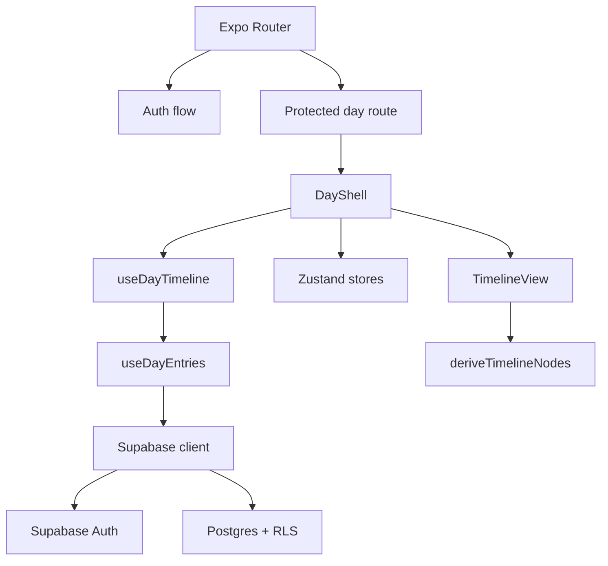

# Architecture

## System Overview

Echotes e um app Expo/React Native com Expo Router na camada de rotas,
Zustand para estado local de sessao e navegacao, Zod para validacao e Supabase
como backend de autenticacao e persistencia.

O baseline atual entrega a superficie diaria autenticada, com timeline derivada
de notas e tarefas do dia e navegacao temporal para tarefas projetadas.

## Component Map

- `app/index.tsx`
  - resolve bootstrap da sessao e redireciona para a rota publica ou protegida
- `app/(auth)/sign-in.tsx` e `app/(auth)/sign-up.tsx`
  - fluxo publico de autenticacao
- `app/day/[date].tsx`
  - rota protegida do dia
- `src/components/day/day-shell.tsx`
  - composicao principal da superficie diaria
- `src/features/day/hooks/use-day-entries.ts`
  - leitura consolidada de notas e tarefas
- `src/features/timeline/utils/derive-timeline-nodes.ts`
  - derivacao da timeline
- `src/features/tasks/api/*` e `src/features/notes/api/*`
  - escrita de dados no Supabase
- `src/lib/env.ts` e `src/lib/supabase.ts`
  - configuracao de ambiente e cliente Supabase

## Layer Boundaries

- Rotas em `app/` montam fluxos e redirecionamentos.
- Componentes em `src/components/` renderizam UI e delegam estado/efeitos.
- Hooks e APIs em `src/features/` concentram comportamento da feature.
- Stores em `src/stores/` guardam estado local de sessao, calendario,
  navegacao temporal e UI.
- Tipos e schemas em `src/types/` e `src/schemas/` definem contrato local.
- `supabase/migrations/` define schema e RLS do baseline.

`TimelineNode` e contrato de dominio; orientacao visual esquerda/direita nao
entra nesse tipo.

## Tech Stack

- TypeScript 5.x
- Expo 54
- React 19
- React Native 0.81
- Expo Router 6
- Zustand 5
- Zod 4
- Supabase JS 2
- Jest + Testing Library React Native

## External Dependencies

- Supabase Auth para email e senha
- Supabase Postgres para `tags`, `tasks`, `notes` e `note_echoes`
- AsyncStorage para persistencia local da sessao do cliente

## Configuration Surface

- `.docguard.json` configura o enforcement documental do repo
- `.agents/` registra skills de agente instaladas por projeto
- `.agent/` e `commands/` podem ser gerados por automacao do DocGuard
- `app.json` descreve configuracao do app Expo
- `babel.config.js`, `metro.config.js` e `tsconfig.json` sustentam o runtime e
  o build local
- `eslint.config.js` e `jest.config.js` sustentam os gates de qualidade
- `.expo/`, `.expo-export-audit/` e `.expo-web*.log` sao artefatos locais e nao
  canones

## Diagrams

## Routes

- `/`
  - bootstrap e redirecionamento
- `/(auth)/sign-in`
  - entrada publica
- `/(auth)/sign-up`
  - cadastro publico
- `/day/[date]`
  - superficie diaria protegida

## Data Flow

1. `app/index.tsx` consulta `useAuthSession`.
2. Com sessao valida, a navegacao vai para `/day/[date]`.
3. A rota protegida resolve a data, atualiza `calendarStore` e aciona
   `useDayTimeline`.
4. `useDayTimeline` depende de `useDayEntries`, que carrega:
   - notas por `day`
   - tarefas por `source_day`
   - tarefas por `target_day`
5. Os dados validados por Zod viram `TimelineNode[]`.
6. A UI renderiza timeline, listas filtradas, leitores, editores e breadcrumb
   temporal.

## Current Baseline Boundaries

Implementado no baseline:

- auth por email/senha
- superficie diaria protegida
- criacao e edicao de notas
- criacao e edicao de tarefas
- tarefas same-day e projected
- ghost navigation com breadcrumb

Explicitamente fora do baseline atual:

- automacoes
- calendario expandido alem do corte atual
- uso funcional de `note_echoes`
- pipeline de release mobile em producao

## Revision History

- 2026-04-25 - Canon consolidado na raiz apos o fechamento de
  `001-auth-day-surface`
