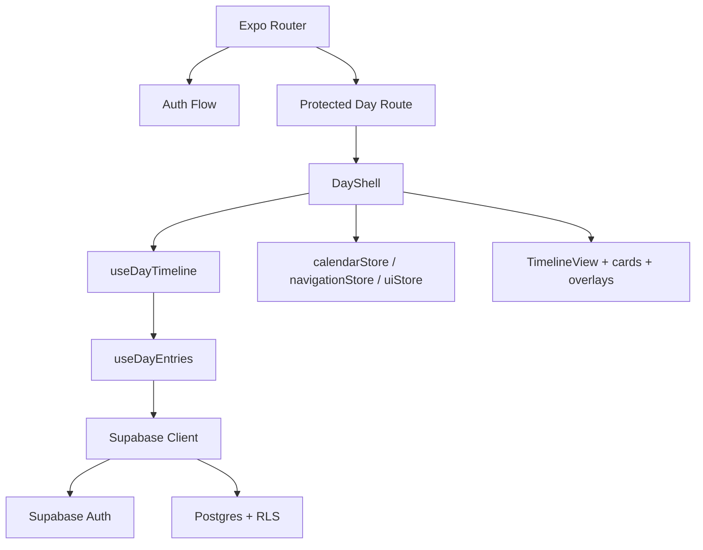

# Architecture

## System Overview

Echotes usa Expo, React Native, Expo Router, Zustand, Zod e Supabase.
Cada rota representa um dia.
A timeline e a vista principal.

O baseline atual entrega auth por email e senha.
O baseline atual entrega superficie diaria protegida.
O corte atual inclui CRUD basico de notas e tarefas.
O corte atual inclui tarefa projected com ghost card e breadcrumb.
O repo tambem guarda regressao automatizada.

## Product Truths

- O dia e a unidade principal do produto.
- A timeline mistura notas e tarefas em um eixo temporal unico.
- `created_at` define a posicao intradiaria base.
- `scheduled_at` cria um segundo ponto real para tarefas com horario.
- Tarefas usam projecao temporal.
- Notas usam ecos.

## Component Map

- `app/index.tsx` inicia a sessao e redireciona o app.
- `app/(auth)/sign-in.tsx` e `app/(auth)/sign-up.tsx` formam o fluxo publico.
- `app/day/[date].tsx` entrega a rota protegida do dia.
- `src/components/day/day-shell.tsx` compoe a superficie diaria.
- `src/components/timeline/*` renderiza eixo, wrappers e acao principal.
- `src/components/cards/*` renderiza cards reais, marker e ghost.
- `src/components/reader/*` abre overlays de leitura.
- `src/components/forms/*` abre overlays de criacao e edicao.
- `src/features/day/hooks/*` carrega entradas e monta a timeline.
- `src/features/tasks/*` concentra regras e APIs de tarefa.
- `src/features/notes/*` concentra regras e APIs de nota.
- `src/utils/*` guarda helpers de data, sort local e formatacao do dia.

## Layer Boundaries

- `app/` compoe rotas e redirecionamentos.
- `src/components/` renderiza UI e traduz eventos de toque.
- `src/features/` implementa comportamento de dominio por feature.
- `src/stores/` guarda estado de calendario, auth, navegacao e UI.
- `src/schemas/` e `src/types/` definem contratos locais.
- `src/utils/` oferece helpers puros usados por formularios e timeline.
- `supabase/migrations/` preserva schema e RLS.

`TimelineNode` pertence ao dominio.
A orientacao esquerda ou direita pertence apenas a camada de renderizacao.

## Tech Stack

- TypeScript 5.x.
- Expo 54.
- React 19.
- React Native 0.81.
- Expo Router 6.
- Zustand 5.
- Zod 4.
- Supabase JS 2.
- Jest com Testing Library React Native.

## External Dependencies

- Supabase Auth para email e senha.
- Supabase Postgres para `tags`, `tasks`, `notes` e `note_echoes`.
- AsyncStorage para persistencia local da sessao.

## Routes

- `/` faz bootstrap e redirecionamento.
- `/(auth)/sign-in` abre a entrada publica.
- `/(auth)/sign-up` abre o cadastro publico.
- `/day/[date]` abre a superficie diaria protegida.

## Stores

### `calendarStore`

- Guarda `selectedDate`.
- Guarda `calendarMode`.
- Em modo semanal, a semana sempre comeca aos domingos.
- A strip semanal acompanha a semana que contem `selectedDate`.
- Uma troca de data fora da semana recalcula a faixa visivel.

### `navigationStore`

- Guarda `sourceDate`.
- Guarda `destinationDate`.
- Guarda `sourceTaskId`.
- Guarda `returnScrollOffset`.
- Guarda `isTemporalNavigationActive`.

Esse store existe para a navegacao temporal de tarefas.

### `uiStore`

- Guarda `activeDayTab`.
- Guarda `readerState`.
- Guarda `editorState`.

O Reader abre apenas item existente.
O Editor opera em `create` e `edit`.
`create` usa item novo.
`edit` exige `id`.

## Data Strategy

Para `selectedDate = D`, a tela carrega:

- tarefas com `source_day = D`.
- tarefas com `target_day = D`.
- notas com `day = D`.

Esse desenho preserva dominios separados.
O baseline evita tabela generica unica.

## Timeline Derivation

Entrada:

- `selectedDay`.
- `tasks[]`.
- `notes[]`.

Saida:

- `TimelineNode[]`.

Regras:

- nota do dia gera `note` com `sortAt` derivado de `created_at`.
- tarefa sem horario em `target_day` gera `task_untimed`.
- tarefa same-day com horario gera `task_creation_marker`.
- a mesma tarefa same-day com horario gera `task_timed`.
- tarefa projected gera `task_ghost` em `source_day`.
- tarefa projected gera o item real em `target_day`.
- projected com horario usa apenas ghost na origem.

Ordenacao:

- `created_at` define a posicao local de notas.
- `created_at` define a posicao local de tarefas sem horario.
- `scheduled_at` define a posicao local de tarefas agendadas.
- o dia exibido sempre usa horario local derivado para ordenar.

## Reader and Editor

Reader e Editor vivem sobre a superficie do dia.
Eles nao viram rotas proprias.

- clique simples abre Reader.
- double tap abre Editor em `edit`.
- o Reader tambem oferece botao de editar.
- nota e tarefa compartilham a ideia de overlay.
- cada dominio usa formulario e leitura proprios.

## Creation and Editing Flows

### Main `+` Action

O `+` abre uma escolha simples.
A pessoa escolhe entre criar tarefa e criar nota.
Depois disso, o app abre o editor correto em modo `create`.

### Task Creation

O editor de tarefa permite:

- definir `target_day`.
- informar `scheduled_time` opcional.
- compor `scheduled_at` a partir de `target_day + scheduled_time`.
- validar `scheduled_at > created_at` antes de persistir.

### Note and Echo Flows

O canon ja descreve nota independente.
O canon tambem descreve eco manual.
O canon tambem descreve `Continuar desta nota`.
O canon tambem descreve mencao inline com `@nota`.

O baseline atual entrega apenas parte desse conjunto.
`CURRENT-STATE.md` indica o que ja chegou ao app.

### Content Mention Flow

Fluxo canonico:

- a pessoa digita `@`.
- o app abre busca de notas existentes.
- a selecao vira chip inline clicavel.
- o save cria ou atualiza eco `manual_link`.

Formato persistido:

- `@[Label da Nota](note:<note_id>)`.

### Continue Note Flow

Ao continuar uma nota, o sistema:

- cria nova nota em um dia escolhido.
- gera briefing automatico.
- permite editar o briefing logo em seguida.
- cria eco `continue_note`.
- preserva o link com a nota de origem.

## Visual States

O baseline precisa destes estados:

- nota real com badge de ecos diretos.
- tarefa sem horario.
- marker de criacao para tarefa same-day com horario.
- tarefa agendada.
- ghost card.
- breadcrumb de retorno.

## Current Baseline Boundaries

Implementado hoje:

- auth por email e senha.
- superficie protegida do dia.
- nota e tarefa same-day.
- tarefa projected com ghost e breadcrumb.
- regressao automatizada do corte.

Canon absorvido para fases futuras:

- fluxos completos de eco.
- `continue_note`.
- mencoes inline persistidas como chip.
- release e deploy de producao.

## Configuration Surface

- `.docguard.json` regula o enforcement documental.
- `.agents/` guarda skills do projeto.
- `.agent/` e `commands/` podem surgir por automacao.
- `app.json`, `babel.config.js`, `metro.config.js` e `tsconfig.json` sustentam runtime e build local.
- `eslint.config.js` e `jest.config.js` sustentam os gates tecnicos.

## Diagrams

## Revision History

- 2026-05-01 - Texto simplificado, `src/utils/` documentado e fluxos reagrupados por responsabilidade.
- 2026-04-26 - Arquitetura ampliada com stores, estrategia de dados, algoritmo da timeline e estado honesto de migracao do canon.
